% Toronto Trip Diary
% Jarmo Syvälahti
% June 7, 2018

# Introduction

This is my travelogue of a trip to Toronto, Canada to attend the Humber College's Global Forum on Innovation and Entrepreneurship 2018. The trip started on 20th of May and I got back home on 28th of May.

The Humber College had invited ten student delegates from its partner schools around the globe to attend the event and two of those openings was allocated to the Jamk University of Applied Science where I study. For one of them the second year Business Information Technology students could apply with an open application. So I thought what a great opportunity and I decided to fill an application. And as I was the only applicant, I got elected.

We had a pre-assignment where we had to identify some of the most pressing and personally important issues in our local communities. Our program for the week included a one-day Design Thinking workshop where we were tasked with innovating a social enterprise that would try to solve a critical challenge common to communities across the globe. And we also took part of the actual two-day Global Forum event and presented our ideas to the audience at the closing ceremony of the event.

My personal motives for the trip were to get some international experience and to try out how I would cope with my English skills.  I wanted to learn more about the Design Thinking method and how to apply it to a team of people with diverse cultural and professional backgrounds.

# Sunday

It was a long, fifteen hour trip to Canada. But everything worked out without too much of a hassle. It was easy for me to just follow the example because the people I was traveling with knew all the hoops you have to go through. 

I first took a train with Niko, my teacher who was also attending the Global Forum, from Jyväskylä to Helsinki-Vantaa Airport which was very convenient. Henna, the other student elected from Jamk joined us there. We flew with Icelandair first to Keflavik and from there to Toronto. It was my first time flying and the experience wasn't that bad, but the second flight felt a bit long and uncomfortable. Although I did enjoy the scenic views from the plane window at times.

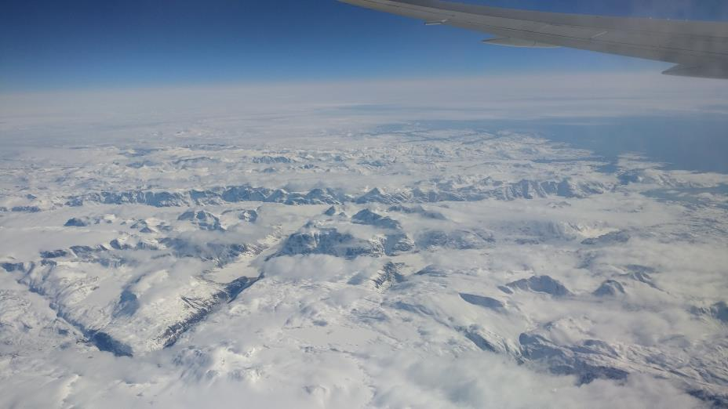

At Toronto Pearson International Airport, the security checks were a bit tighter, numerous and thorough. After we cleared all of them there were two friendly student ambassadors from Humber College waiting for us to take us to the Lakeshore Campus residence and after the taxi ride, they guided us to our rooms. Then it was time for me to get some much-needed rest.

# Monday

Our scheduled first meeting didn't start until 11 AM so I went to take a walk around the Humber Lakeshore campus and the Lake Ontario beach that resides just a couple of hundred meters away. I was fascinated by nature and the many different kinds birds there. The birds seemed very accustomed to people so they let me pretty close by before taking distance.

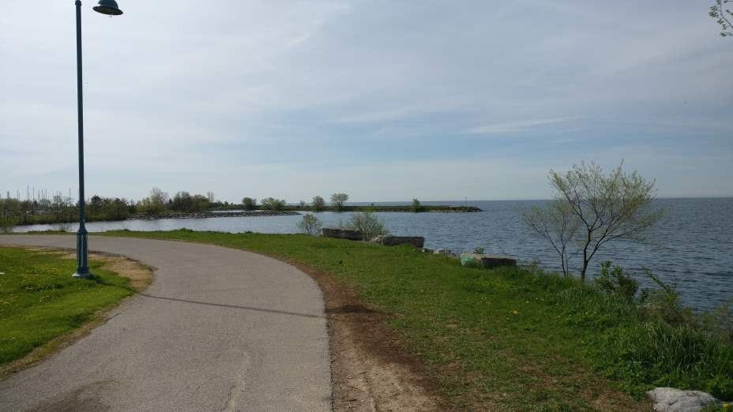

Later in the morning, I got to meet the group of student delegates for the first time. There was a total of 8 of us. We were supposed to have two students from Peru also, but their trip was canceled because of Visa-problems. There were also professional delegates from Indonesia attending that meeting. We played a little icebreaker game, took a tour around the campus and had some delicious lunch.

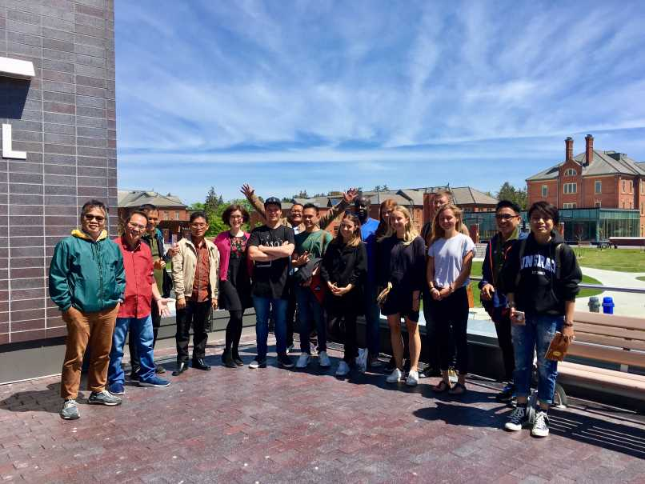

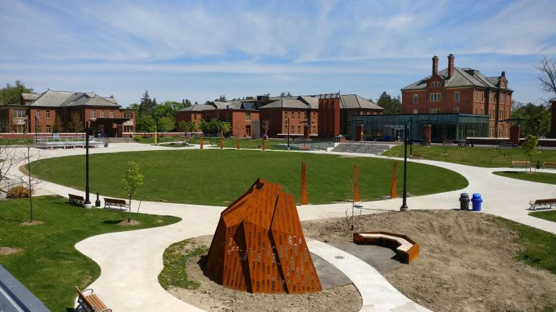

After that, we decided to head out to the city guided by two of Humber's student union actives, a previous and a current vice president. We took a bus and a city car to downtown and walked the streets, stopped by a bar and some vintage clothing stores. There was so much to see and the busy metropolis was something quite different than what I had accustomed to. It was also a good chance to get to know the group and do something fun together.

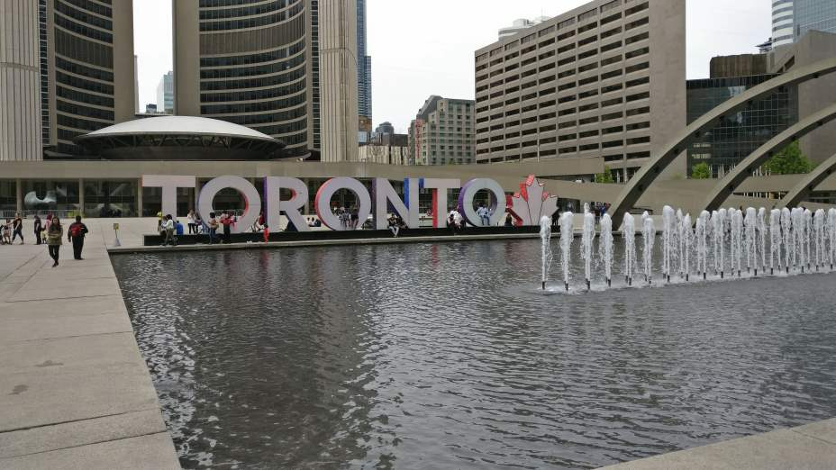

# Tuesday

We had the Design Thinking workshop today. After the introductions and a little building empathy game, we got right into it.

We brought our pre-assignment with us in that we had to recognize an issue in our community that was important to us. Then we voted the three issues we wanted to start working on and formed groups around them.

We started to flesh the ideas using methods of project canvas and prototyping. After we had our ideas shaped we had to form a pitch out of it and present it in front of the group. We did this all in a day of work so the schedule felt a bit tight.

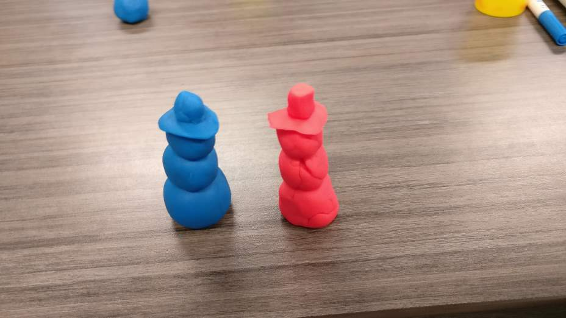

But I learned that you can succeed in creating, prototyping and presenting an idea in just a short amount of time if you have the right methods and some passion behind it. I also discovered that I get along just fine with my English skills and I barely had any issues understanding others and getting my message across.

It was very fruitful day and I did get out of it a lot more than I did in a whole week of innovating previously at my homeschool. I'm sure that the passion of the participants and the professionality of the Taking IT Global members that hosted the workshop played a big part in it as did the fact that we could innovate solutions to things that mattered to us.

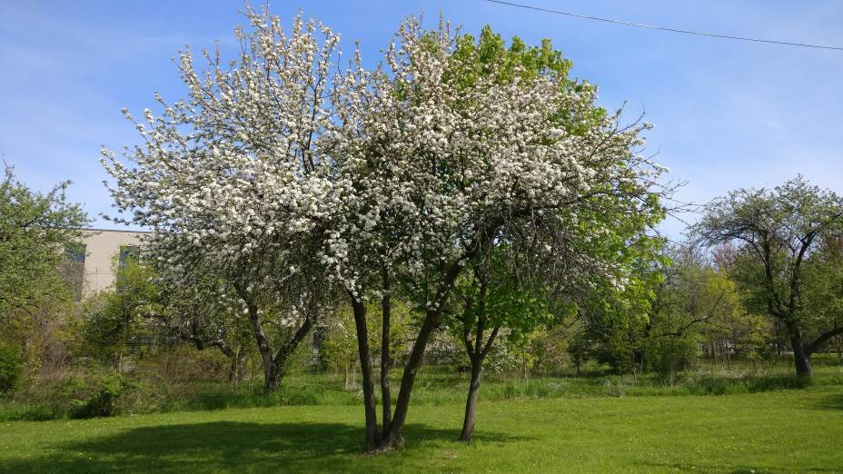

Ashley, Humber's International Mobility Coordinator had arranged a dinner for me, Henna, Niko and couple of Humber students from Sports Management who were coming for exchange to Jamk next fall at a nearby pizza place called 850 Degrees Pizza. The starters were delicious and the pizza there was so great I can't remember the last time I had so good pizza.

# Wednesday

Today was the first day of the Global Forum on Entrepreneurship and Innovation at Humber. The opening keynote speech from Sheldon Levy, the CEO of NEXT Canada was a very interesting outlook on the future, how the global megatrends change the playing field of education and work.

I also attended a couple of workshop sessions about international mobility and supporting student entrepreneurship. I didn't get that much out of those.

The lunch was great and it was served outside in a perfect summer weather. I had some good discussions with the delegates from other schools around the globe and it was very interesting to hear how they do things.

We were also supposed to hold a presentation of our Tuesday's ideas in the closing ceremony of the Global Forum on the next day. We managed to include a brief moment to start working on my team's presentation with Dylan, my teammate from New Zealand.

We had some exciting evening activity planned for us too. We went to see a baseball game, Toronto Blue Jays vs Los Angeles Angels. The Rogers Centre stadium was huge. Even though I'm not a fan of the sport but the atmosphere was something to experience and it was good entertainment. The four hours game was tight until the end although the home team unfortunately lost.

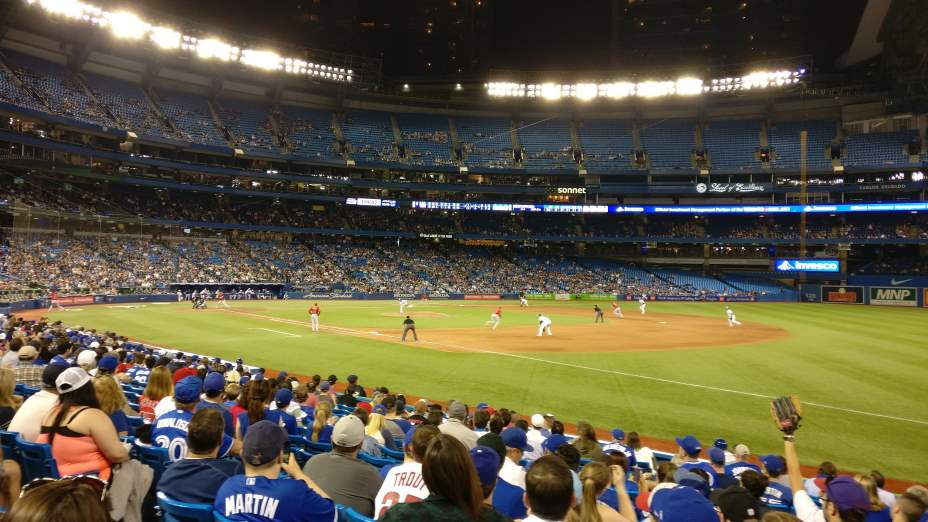

# Thursday

For the second and last day of the Global Forum, there was an opening session called Fireside Chat where a local attendee and two delegates from Denmark and China had a conversation about varying topics of education and entrepreneurship theme. I didn't find it that interesting compared to the keynote from yesterday.

Today we decided to spend more time on getting the presentation ready and rehearsed. Working on it proceeded swiftly and we had it ready well on time. I had some time to go see my teacher's workshop and it was interesting to see the project development module we had this year from an outsiders perspective.

It was time for the closing ceremony and our presentation. I was very nervous about it because I know my presentation skills aren't that good and we had to do it in English of course which made it that much more difficult.

Our turn was last and I was at awe on the other groups doing so well and getting a great receiving from the audience. Our presentation also went quite well and I was so relieved. After the presentations, we got certificates and a little gift to take home. After the event, many people commended our presentations. For me, it was an important experience and I'm now more confident in presenting on stage in English.

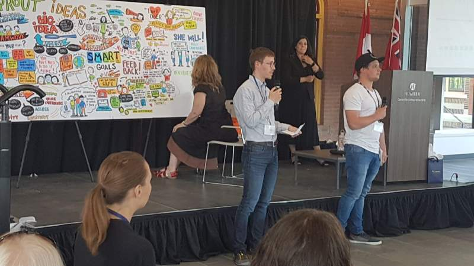

In the evening I went shopping for some groceries in a nearby supermarket called No Frills. Prices were somewhat cheaper than in Finland, especially on fruits and vegetables. Portion sizes were clearly bigger though and the healthier foods were a bit scarce. To my surprise, I found some 'Näkkileipä' (dry rye bread) made in Finland.

# Friday

Ashley was very kind of arranging a transportation to Niagra Falls for our group. We had the two ambassador students that picked us from the airport on Monday to accompany us and we took a school bus there. The drive there took only an hour.

After a small snack we went down to the river and a spectacular view opened before us. 

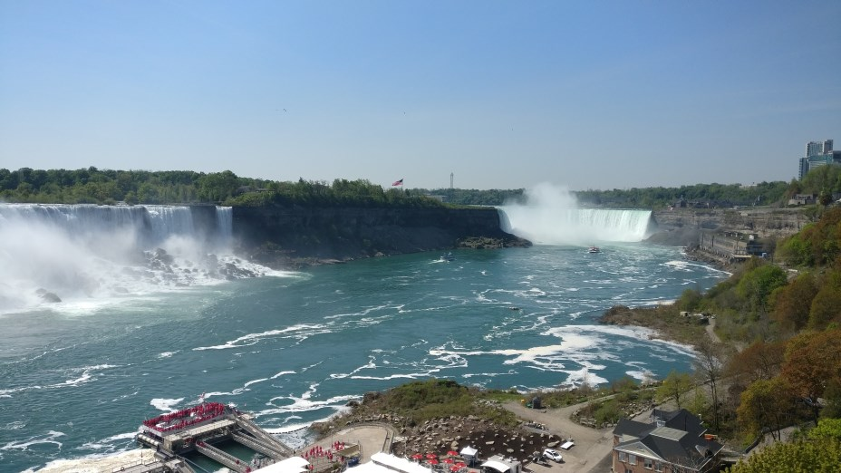

As a first thing, we went for a boat ride that took us close to the horseshoe falls. That was crazy, the sound and air pressure were quite intense at close-up and of course, we got pretty wet even though they gave us raincoats.

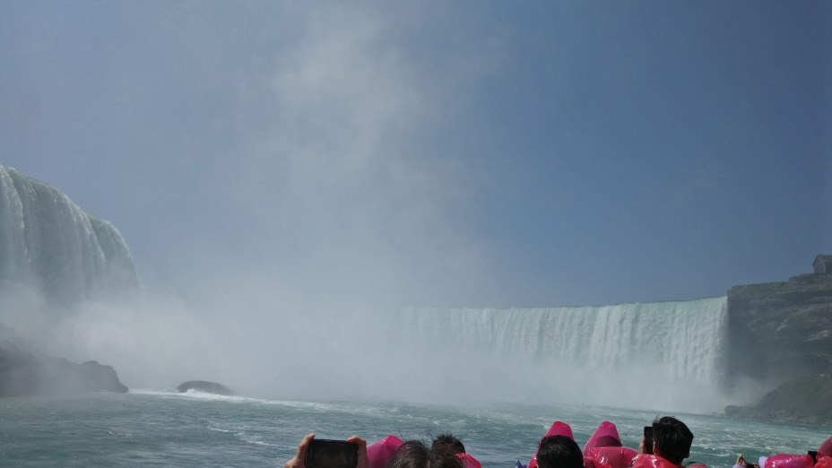

After the boat ride, we went to have a lunch at Kelsey's Roadhouse and then walked around to see some more of the falls.

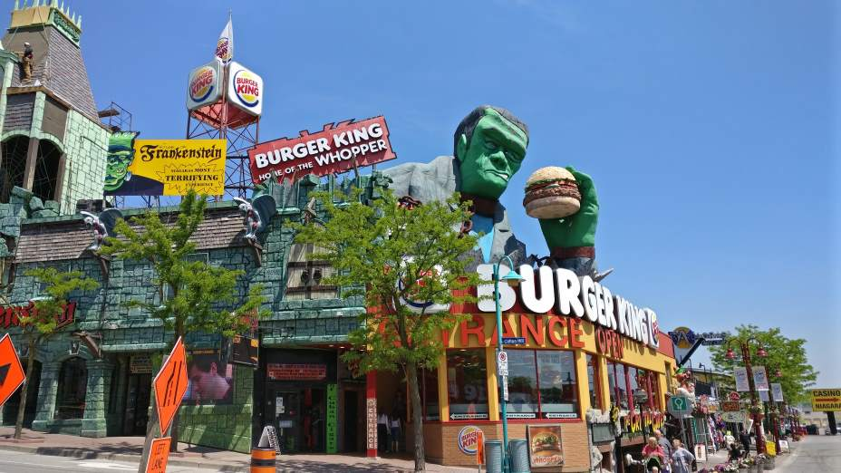

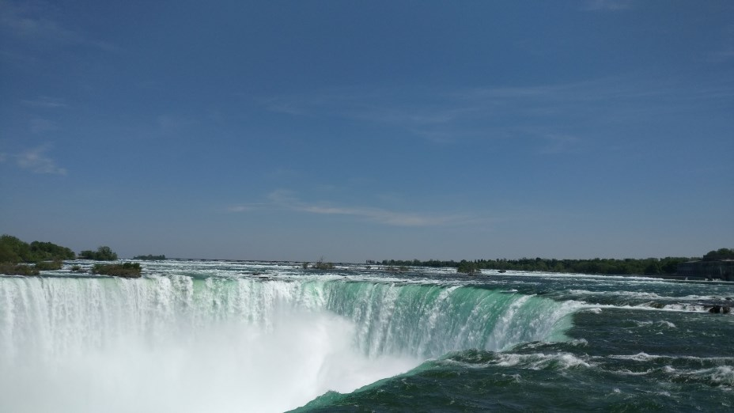

The drive back wasn't as swift because we hit a traffic jam and ended up spending two and half hour crawling the Lakeshore Road. At least we got to see the hoods down there and the gorgeous mansions near the shore.

In the evening I went with Henna to meet her local friend and his girlfriend to a bar downtown called The Loose Moose. We had something to eat and drink and fun conversations. After that, we walked around the city a bit and I got to see it during the night, and it was lively and exciting.

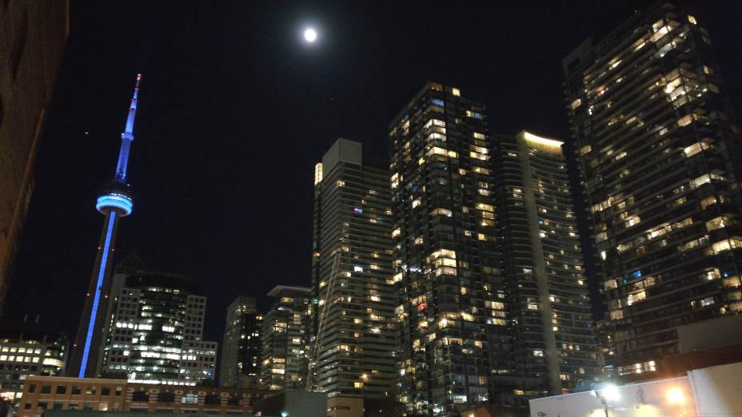

# Saturday

We wanted to go for a  sightseeing to downtown to visit some of the popular places there.

First, we went to the Hockey Hall of Fame. There was a lot of stuff there to see, a fake Stanley Cup included.

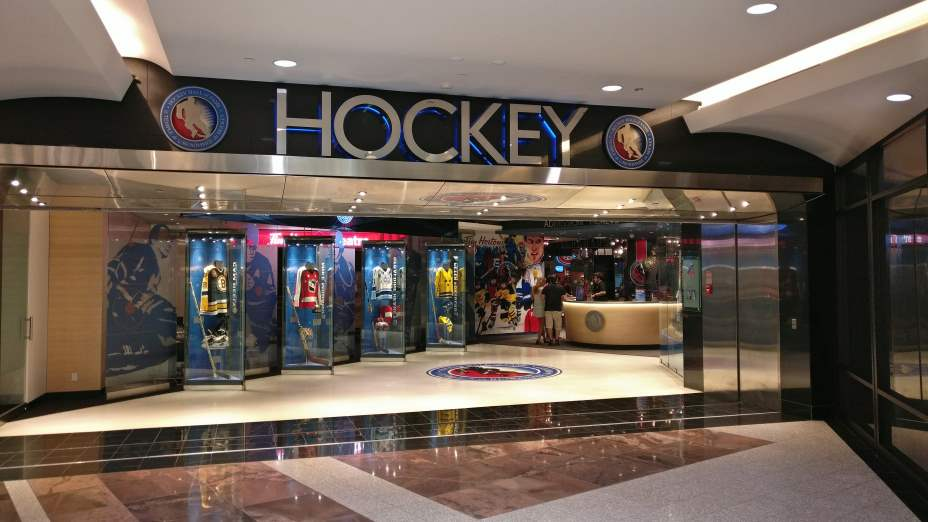

Then we went to check out the CN Tower. The view from the top was spectacular and you could get a good overview of the city. The place was crowded as was to be expected on a weekend.

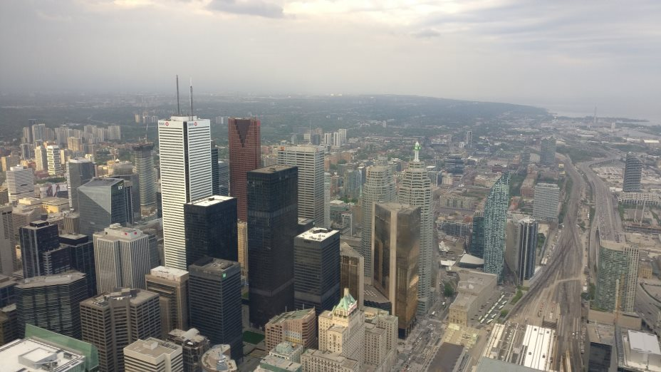

After we got down from the tower we went to have some dinner. I had the best chicken salad ever at Jack Astor's. And it was big.

The last place we visited was Ripley's Aquarium of Canada. This place was definitely my favorite, so many different kinds of fish and other sea dwellers to see. We spent two hours touring that place and marveling all the colorful and weird things. I think the sharks, stingrays, and turtles were the top things I saw there.

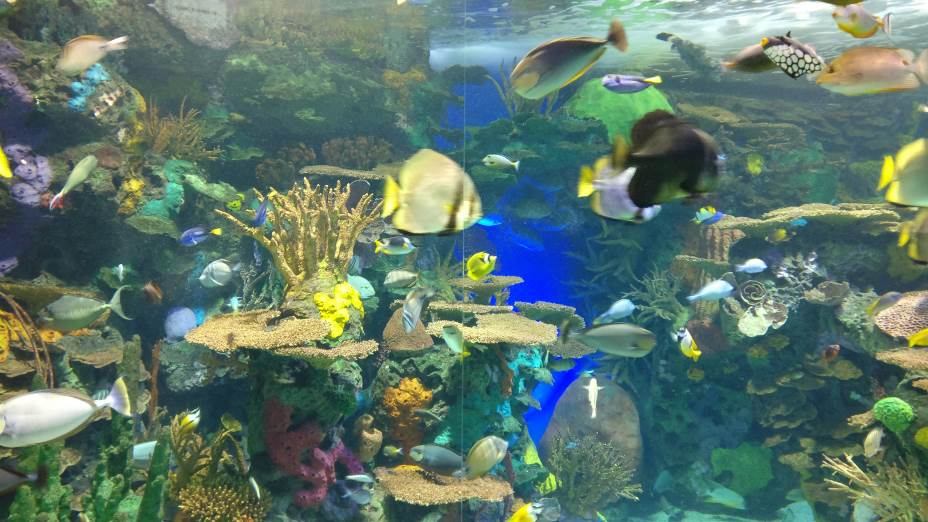

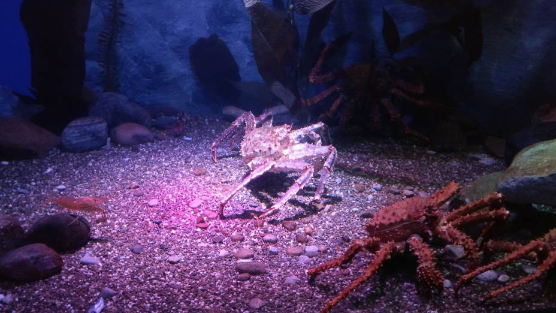

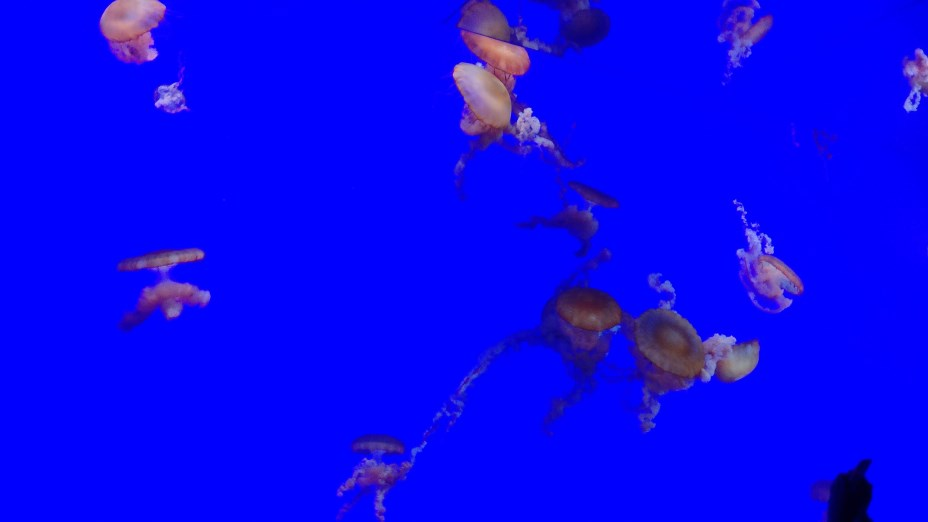

# Sunday

It was time to pack our packs and checkout of our residence. We went for a little walk to pass the time and visited Lakeshore Arena, a nearby ice hall. We heard from a local that the Toronto Maple Leafs also practice there.

In the evening we took a taxi to the airport. Our flight left at 9 PM local time and a long and tiring trip back home commenced.

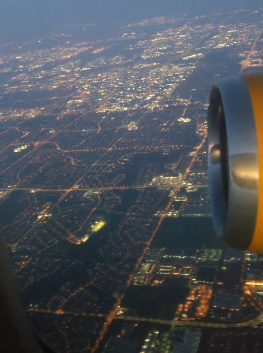

# Closing Thoughts

What a memorable journey it was. I think it's one of the best experiences of my life so far. I learned and experienced so much during only a one week. The group of students we had was quite a gang of personalities and passions, we had a lot of fun together. I already miss them.

I found out that I had no trouble of expressing myself in English well enough and there's really nothing stopping me from acting in an international environment and I didn't feel too much of an outsider in the multicultural city of Toronto.